# Cookies

Who doesn't love cookies? Try to figure out the best one. http://mercury.picoctf.net:21485/

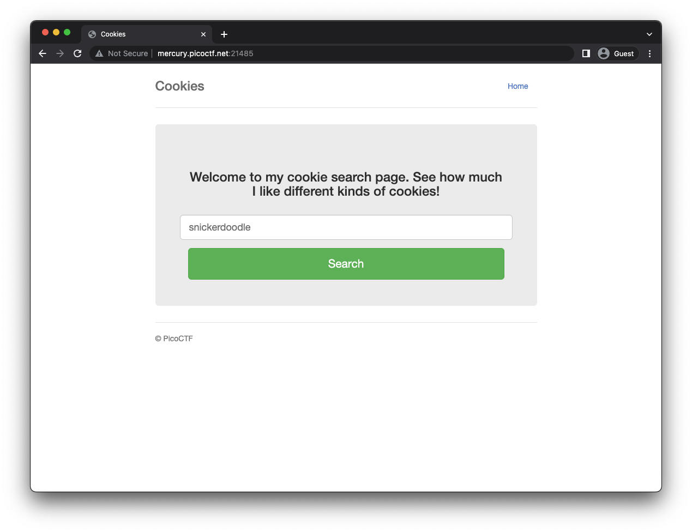

## Testing Input

Submitting 'snickerdoodle' results into the ff:

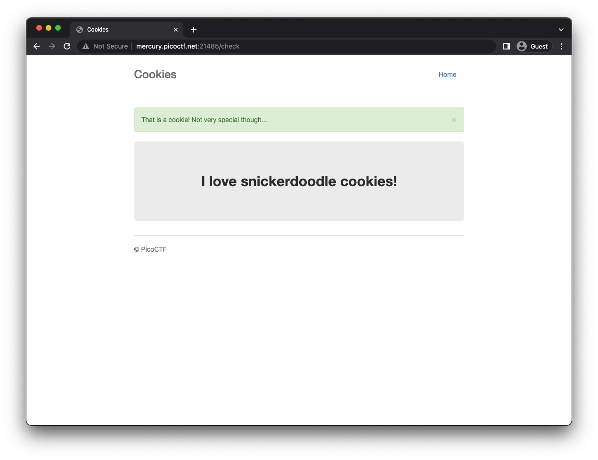

I need to pass a proper key word to show the flag?

## Investigating cookies

- The initial value of the `name` cookie is `-1`.


- When you provide a valid cookie but not a special one, the value of the `name` cookie is `0`.

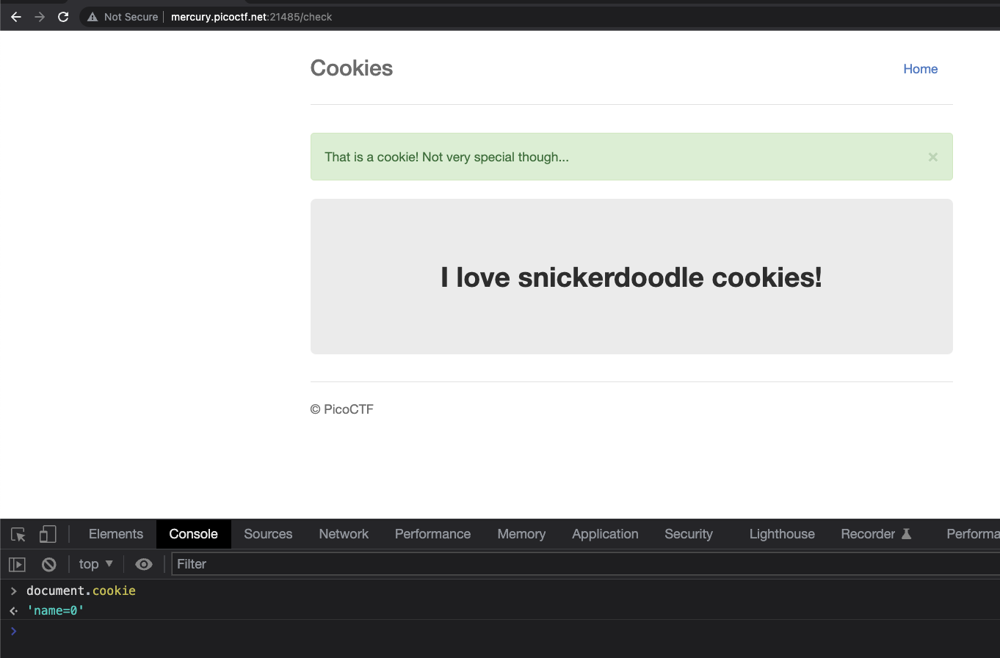

The cookies are set by the Response Headers when we perform a submit request to the `/search`.

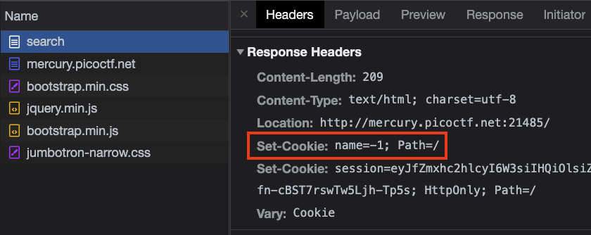

## Multiple Redirects

By setting the cookie as `Secure` and `HttpOnly`, once you submit another value it'll keep on redirecting, and crashes.

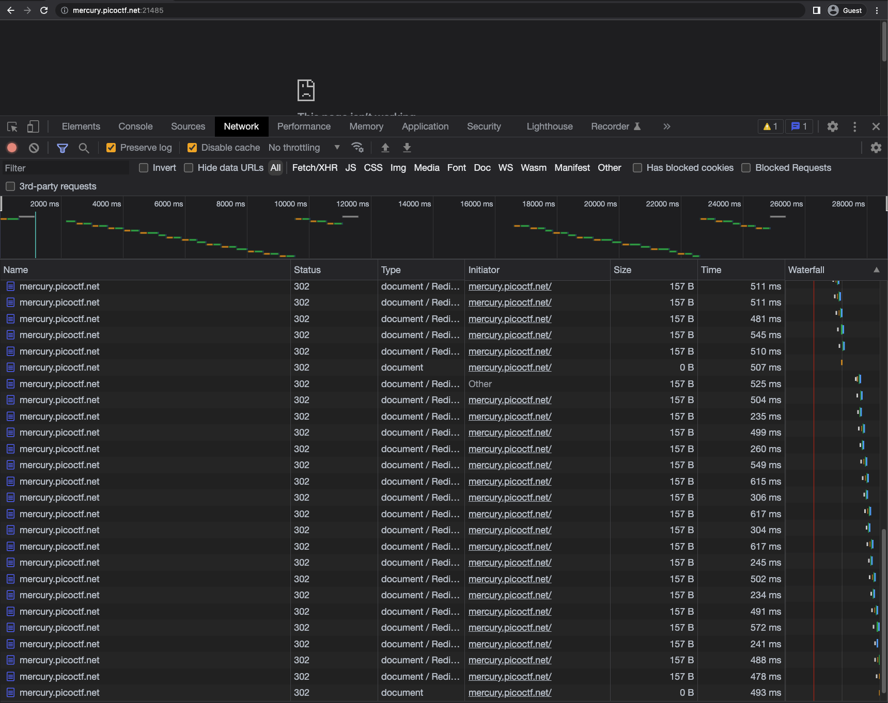

[multiple-redirects](resource/multiple-redirects.mov)


## Brute Force - Cookie Names

Getting a list of top cookies
https://www.allrecipes.com/gallery/most-popular-types-of-cookies/

Performed a brute force attack using Burp intruder, but I got most of them as a valid cookie, but they are not special 🥺.

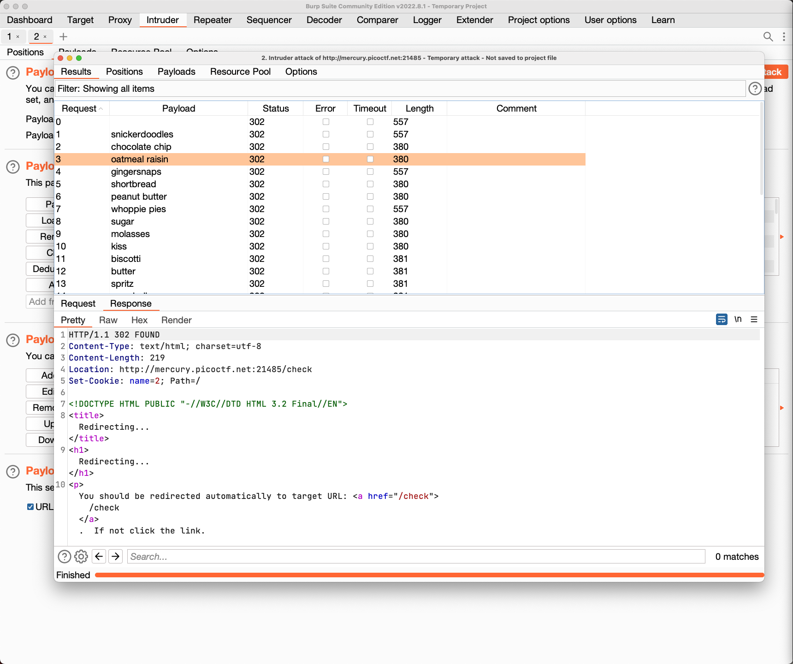

## Changing Cookie Value

Based from previous brute force, the value of the `name` cookie could spit different output.
- Let's try to set it to `0`

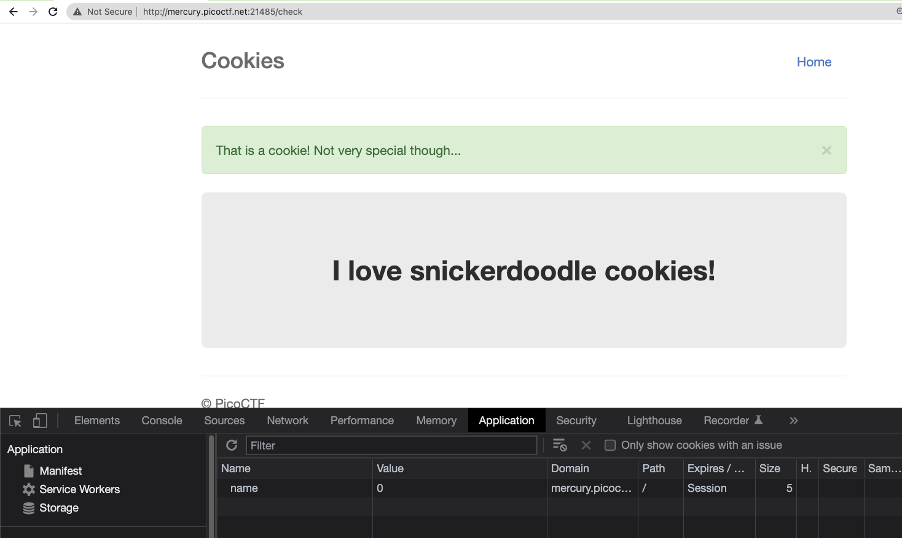

It accepts it, and treats it as a valid cookie.

- Let's try to set it to `-2` and different negative values.


It is not showing a different response.

- Let's try it with another positive value
Using `2` and `3`. It seems like it is showing me the cookies that I input earlier?

## Brute Force - Values

Instead of brute forcing cookie names, we'll brute force it with name values.

[burp-intruder-value](resource/burp-intruder-value.mov)

After waiting for the values, let's see if there are interesting results.

Well...they are all redirects, I need to configure the intruder to follow them.

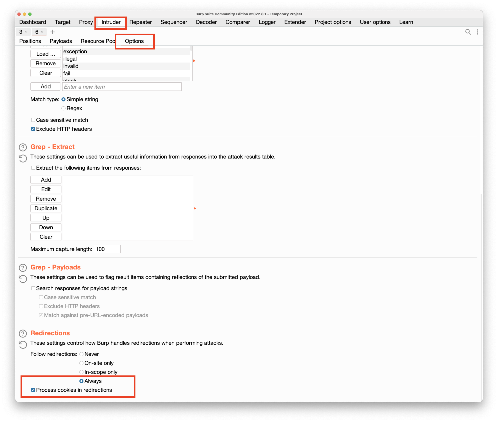

I set the option to process the cookies, as we are investigating that.

I still think that I have misconfigured something, as they are all the same.

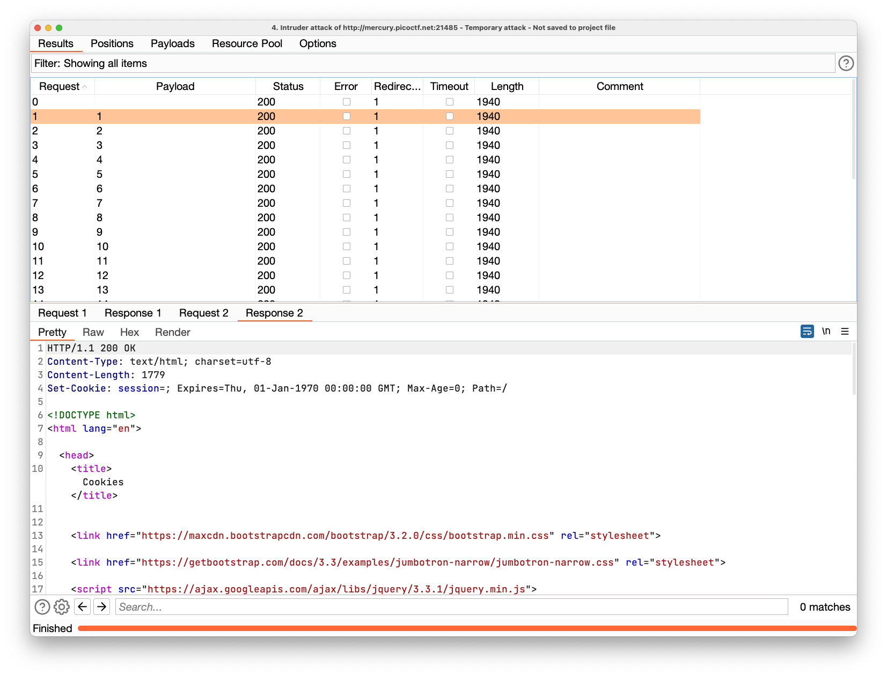

I need to figure out first with few values, on how to properly pass the cookies. Should've tested it first with the repeater.

- One more try

After few mins of debugging, I should use the `GET /` endpoint, and not the `POST /search`.

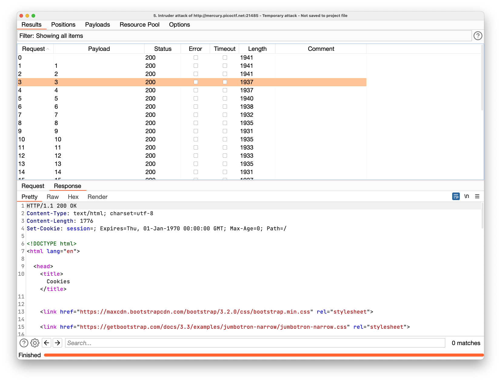

I am now gettng a different response length.

- Result investigation

Sorting it by length, will help me efficiently check for unique responses.

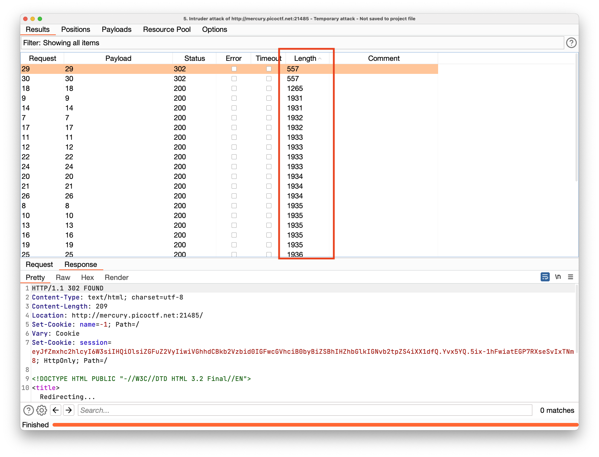

Lucky for me that the request with `1265` length at sort order 3 has the flag.

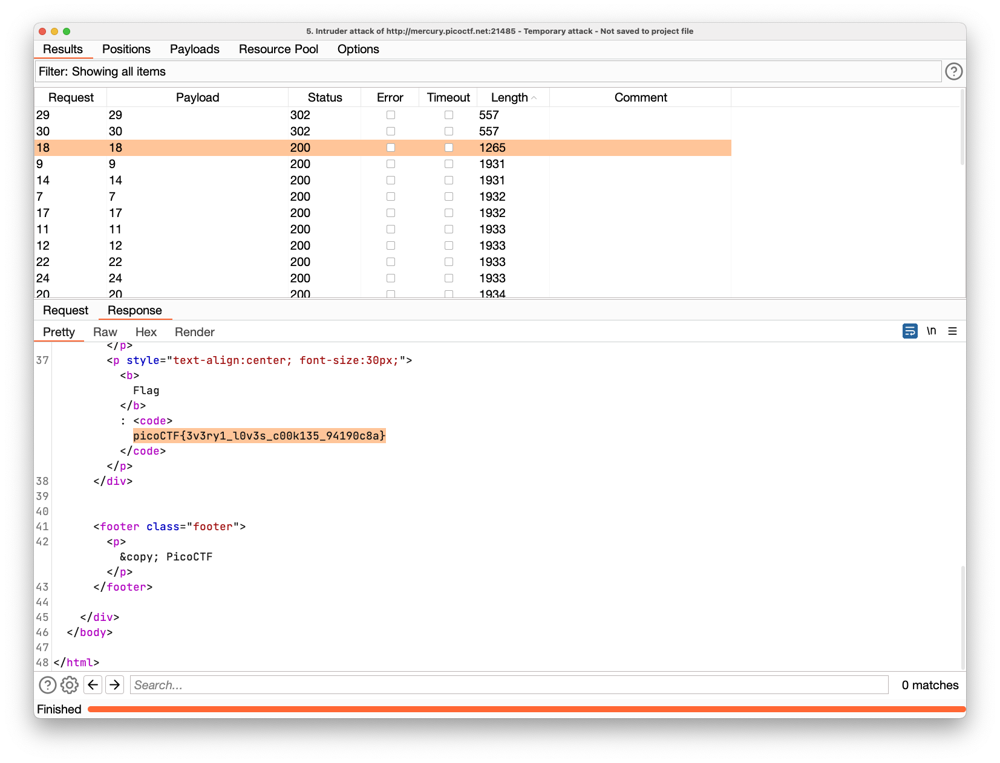


## Flag

```
picoCTF{3v3ry1_l0v3s_c00k135_94190c8a}
```

