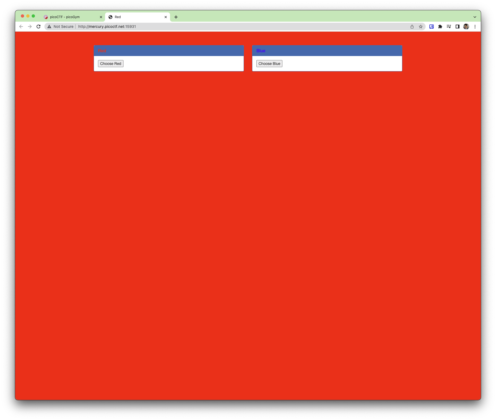
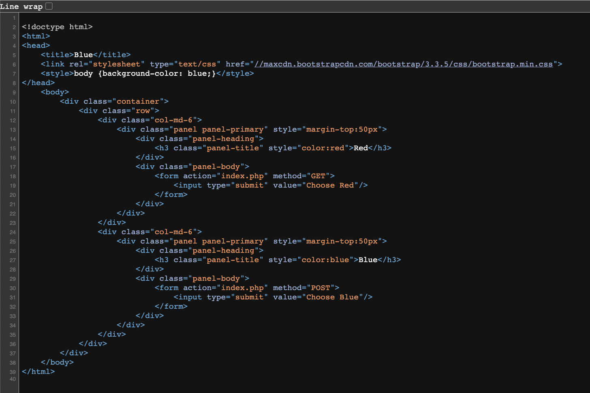
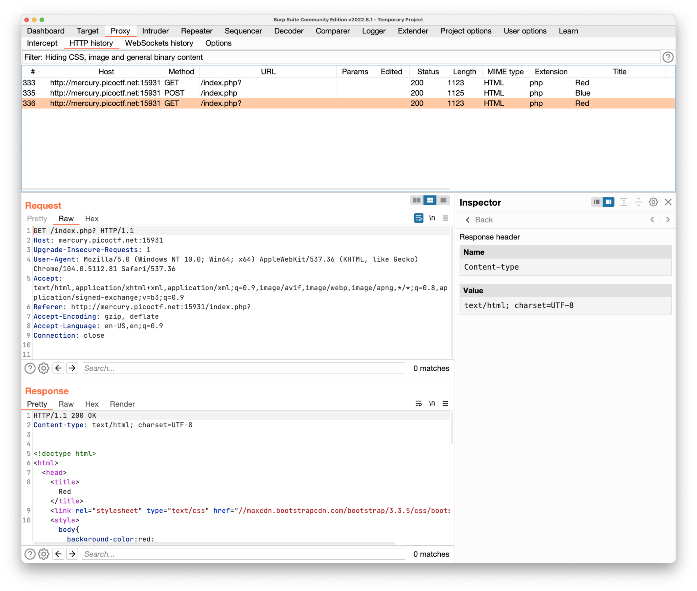

# GET aHEAD

Find the flag being held on this server to get ahead of the competition http://mercury.picoctf.net:15931/



Clicking the button, only changes the background color.

Looking at the network, it creates POST request with Blue, and GET request on Red.

## Page Source



It uses `bootstrap v3.3.5` as its styling.

## Burp Suite

I tried using the Burp Suite Community Edition, but I don't see any value being passed. This is unlike APIs.
The title of course changes as we go.



## TRY Performing a request with `HEAD` HTTP option

https://user-images.githubusercontent.com/21978370/184734141-28cb1d00-fb5a-4064-85a7-4e6be9dad931.mov

This can also be achieved with performing a request using curl.

```curl
curl -I 'http://mercury.picoctf.net:15931/index.php'

HTTP/1.1 200 OK
flag: picoCTF{r3j3ct_th3_du4l1ty_82880908}
Content-type: text/html; charset=UTF-8
```

## Flag

```
picoCTF{r3j3ct_th3_du4l1ty_82880908}
```

