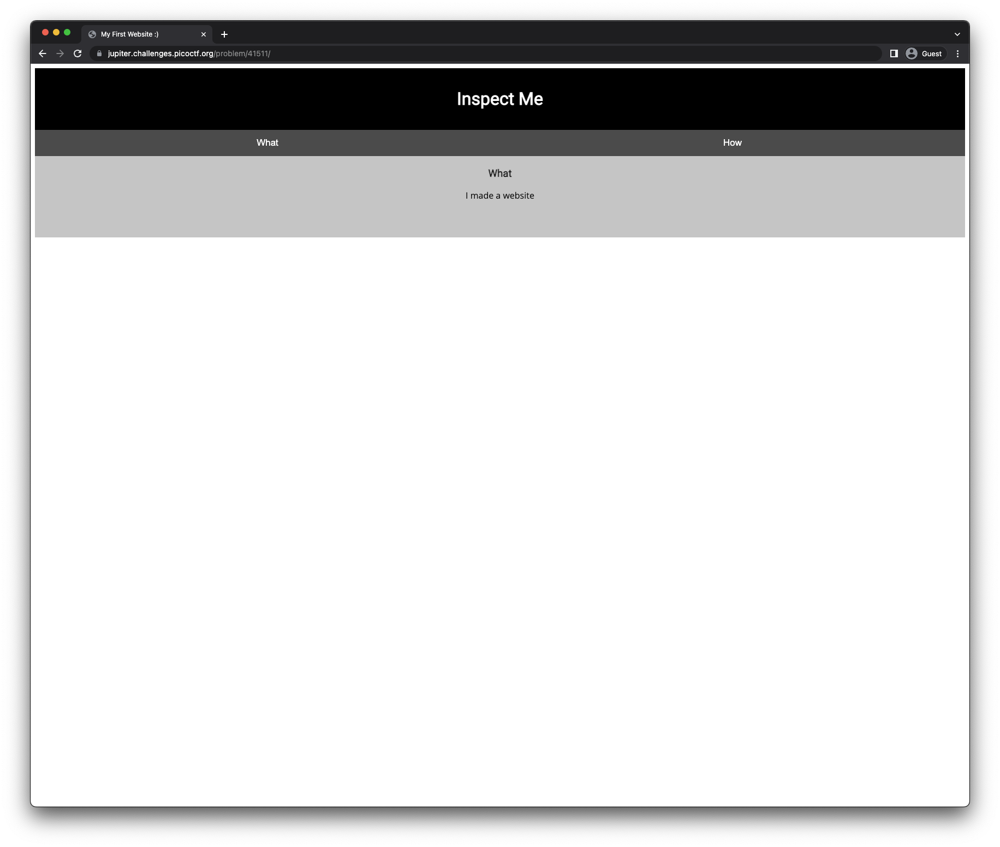
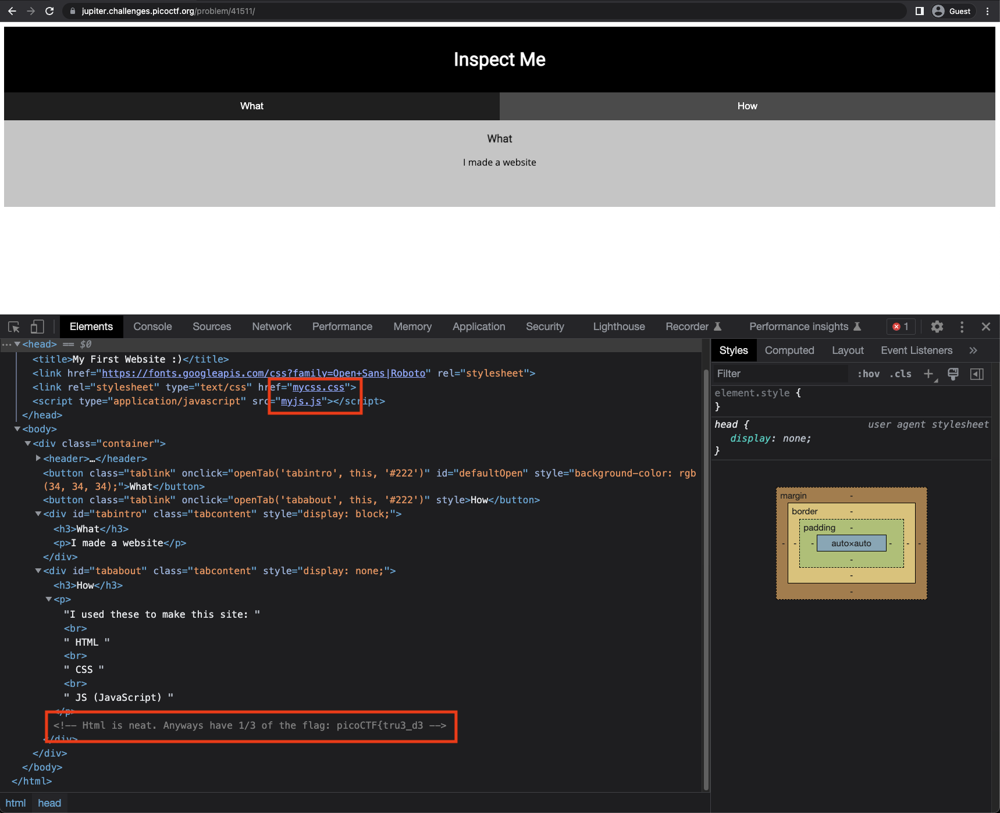
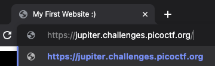
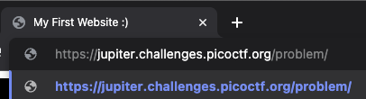
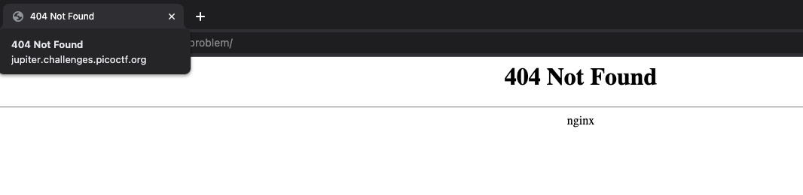
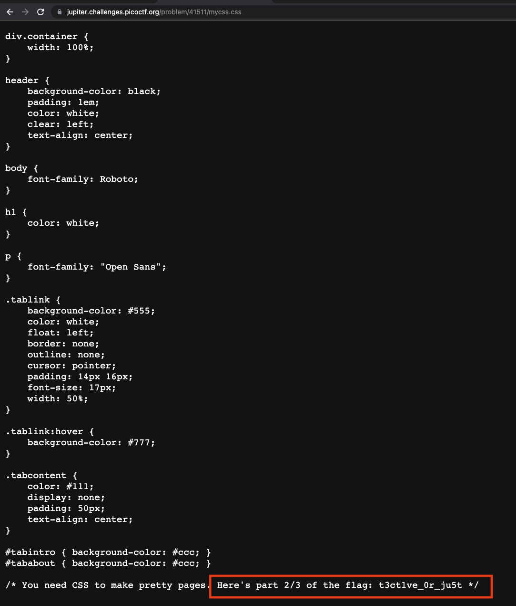
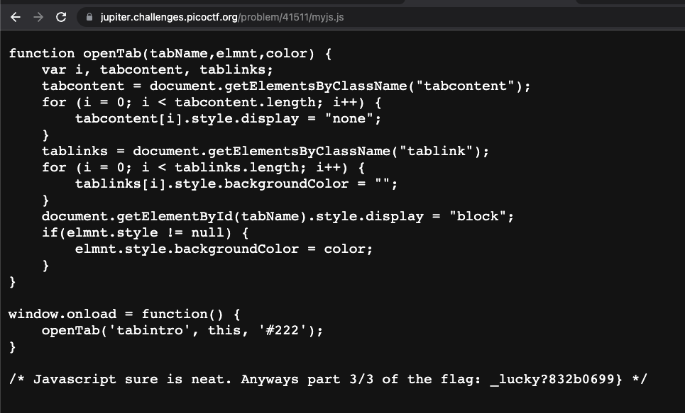

# Insp3ct0r

Kishor Balan tipped us off that the following code may need inspection:
https://jupiter.challenges.picoctf.org/problem/41511/ ([link](https://jupiter.challenges.picoctf.org/problem/41511/)) or
http://jupiter.challenges.picoctf.org:41511



## Inspect View



There are resources that are being sourced:
- `mycss.css`
- `myjs.js`

It also provided me the part of the flag.

`picoCTF{tru3_d3` (1/3)

## Navigating URL with `/`



It downloaded an HTML file.

- filetype
```sh
file download

download: HTML document text, ASCII text
```

- content
```sh
cat download

<!DOCTYPE html>
<html>
<head>
<title>Welcome to nginx!</title>
<style>
    body {
        width: 35em;
        margin: 0 auto;
        font-family: Tahoma, Verdana, Arial, sans-serif;
    }
</style>
</head>
<body>
<h1>Welcome to nginx!</h1>
<p>If you see this page, the nginx web server is successfully installed and
working. Further configuration is required.</p>

<p>For online documentation and support please refer to
<a href="http://nginx.org/">nginx.org</a>.<br/>
Commercial support is available at
<a href="http://nginx.com/">nginx.com</a>.</p>

<p><em>Thank you for using nginx.</em></p>
</body>
</html>
```
This provides an information that they are using nginx.

## Navigating at `/problem`



Resulted into a `404` page.



## Visiting CSS resource



It provided me another part of the flag.

`t3ct1ve_0r_ju5t` (2/3)

## Visiting JS resource



It provided me the last part of the flag.

`_lucky?832b0699}` (3/3)

## Flag

```
picoCTF{tru3_d3t3ct1ve_0r_ju5t_lucky?832b0699}
```

