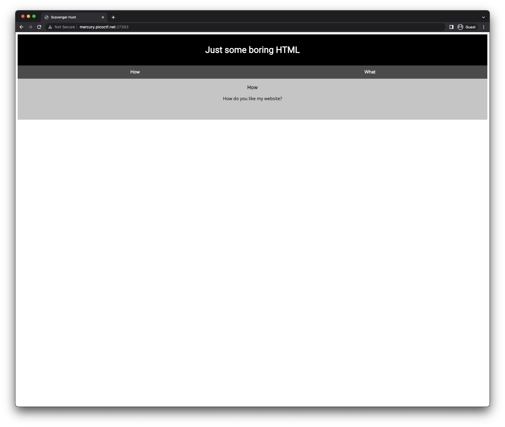
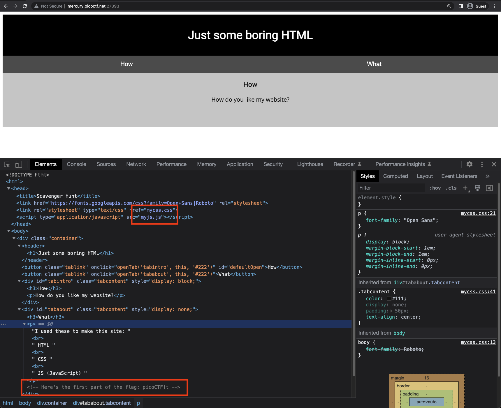
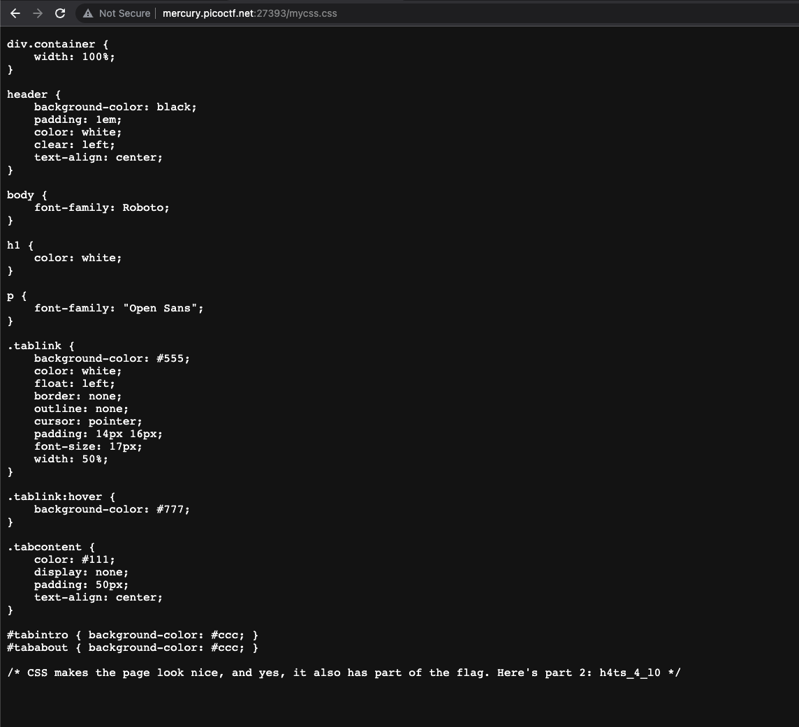
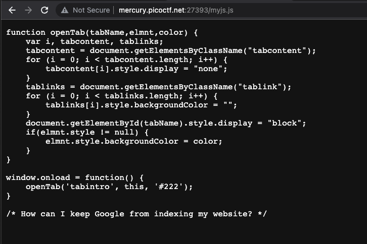
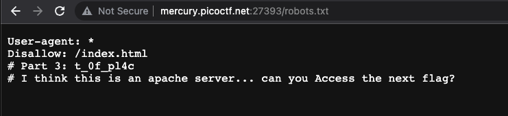
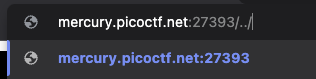
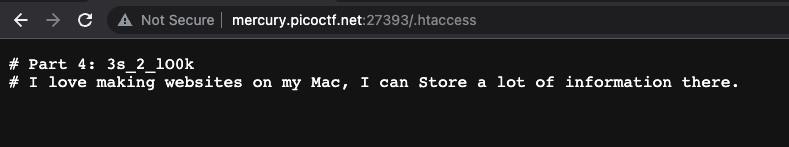
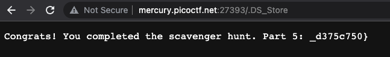

# Scavenger Hunt

There is some interesting information hidden around this site http://mercury.picoctf.net:27393/. Can you find it?



## Inspect View



It is using two resources:
- `mycss.css`
- `myjs.js`

This also provided me the first part of the flag.

`picoCTF{t` (1/n)

## Visiting CSS resource



It provided me the second part of the flag.

`h4ts_4_l0` (2/n)

## Visiting JS resource



There is no flag here, but there was a hint about indexing. I think that it refers to the sitemap and `robots.txt`.

## Visiting `robots.txt`



This provided me the third part of the flag.

`t_0f_pl4c` (3/n)

There's also a hint about accessing the server.

## Traversing the directory



It just reloaded the page and redirected back to `/`

## Accesing different diretories and files

- Look into the directory structure of apache servers.
Accessing `conf` and `modules` results into `404`.
- http://mercury.picoctf.net:27393/conf
- http://mercury.picoctf.net:27393/modules

- Accessing `.htaccess`



- http://mercury.picoctf.net:27393/.htaccess

Found the fourth part of the flag.

`3s_2_lO0k` (4/n)

Hint about using Mac for the website development

## Look into `.DS_Store` file



Found the last flag, lucky for me that I'm using MacOS and familiar with this dotfile.

`_d375c750}` (5/5)

## Flag

```
picoCTF{th4ts_4_l0t_0f_pl4c3s_2_lO0k_d375c750}
```

